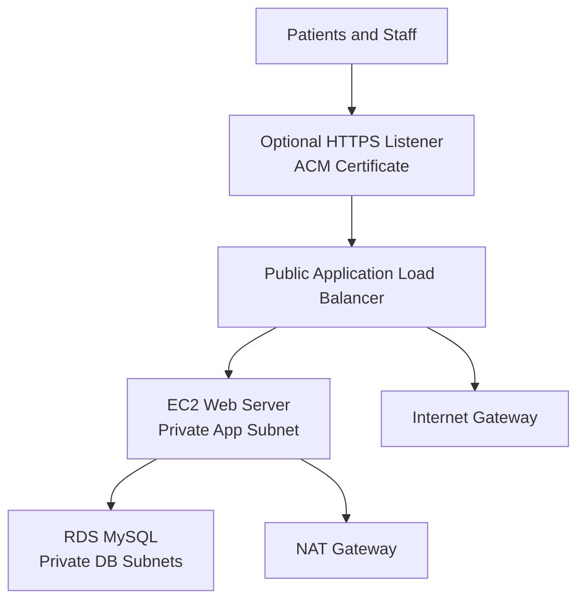

# MedCare Appointment Booking Platform on AWS

[](https://github.com/ucfavour23/medcare-appointment-booking-platform-on-aws/actions/workflows/ci.yml)


MedCare Appointment Booking Platform is a production-style AWS project for a healthcare scheduling workload. It combines a working Flask appointment app with a multi-tier AWS architecture, private compute, private database storage, load balancing, optional HTTPS, CI validation, and deployment evidence.

The project deploys a Flask appointment booking app behind an Application Load Balancer, runs the web tier on EC2 in private subnets, and stores appointments in an RDS MySQL database isolated in private database subnets.


## Business Problem

MedCare needs a repeatable way to host an internal appointment booking system with:

- Public web access through a controlled load balancer
- Private application servers
- Private managed database storage
- Segmented network tiers
- Infrastructure-as-code deployment
- Clear operational evidence for recruiters and interview discussions

## Solution

This project packages the booking workflow, AWS infrastructure, deployment automation, validation checks, and evidence screenshots into one repository. The app can run locally with SQLite for fast testing, then run in AWS with MySQL on RDS for a production-style deployment.

## Features

- Patient appointment booking form and recent appointment history
- Local SQLite mode for development and tests
- RDS MySQL mode for deployed AWS usage
- Public Application Load Balancer entry point
- Private EC2 web server with no public IP
- Private RDS database subnets
- Optional HTTPS listener with ACM certificate support
- HTTP-to-HTTPS redirect when TLS is enabled
- Flask security headers and HSTS support
- Docker runtime files
- GitHub Actions CI for tests, Terraform checks, and Docker build
- Screenshot evidence for local app, tests, Terraform, AWS deployment, and live service health

## What This Demonstrates

| Area | Evidence |
| --- | --- |
| Cloud architecture | Public ALB, private EC2 app tier, private RDS database tier |
| Network design | VPC segmentation, subnet tiers, NAT egress, route tables |
| Security | Tiered security groups, private database, optional ALB HTTPS, Flask security headers |
| Automation | Terraform provisioning, EC2 bootstrap, Docker build, GitHub Actions CI |
| Application delivery | Flask booking workflow, MySQL/RDS mode, SQLite local mode, tests |
| Operations | Health endpoint, deployment outputs, screenshots, evidence docs |

## Architecture



## AWS Services

| Layer | Services |
| --- | --- |
| Network | VPC, public subnets, private app subnets, private database subnets, route tables, Internet Gateway, NAT Gateway |
| Compute | EC2 Ubuntu web server |
| Database | RDS MySQL, DB subnet group |
| Traffic | Application Load Balancer, target group, listener |
| Security | Security groups, optional ACM-backed HTTPS listener, IAM instance profile |
| Operations | CloudWatch-ready EC2 role and deployment outputs |

## Technology Stack

| Area | Tools |
| --- | --- |
| Cloud | AWS VPC, ALB, EC2, RDS MySQL, IAM, NAT Gateway |
| Infrastructure | Terraform |
| Application | Python, Flask, Gunicorn, PyMySQL |
| Local data | SQLite |
| Containers | Docker, Docker Compose |
| Testing | Pytest |
| CI/CD | GitHub Actions |
| Version Control | Git, GitHub |

## Security Features

- Public traffic terminates at the Application Load Balancer.
- EC2 web server is private and only accepts app traffic from the ALB security group.
- RDS MySQL is private and only accepts database traffic from the web security group.
- Optional HTTPS listener uses an ACM certificate and redirects HTTP to HTTPS.
- Flask emits `X-Content-Type-Options`, `X-Frame-Options`, `Referrer-Policy`, `Permissions-Policy`, and HSTS when HTTPS is active.
- Terraform state, local database files, credentials, and generated caches are excluded from git.

## Repository Structure

```text
app/                    # Flask appointment booking application
docs/                   # Architecture, deployment guide, evidence checklist
scripts/                # Local evidence rendering helpers
terraform/              # AWS multi-tier infrastructure
tests/                  # Application tests
Dockerfile
docker-compose.yml
README.md
```

## Local Demo

```powershell
python -m venv .venv
.\.venv\Scripts\Activate.ps1
pip install -r app\requirements.txt
python app\app.py
```

Open:

```text
http://127.0.0.1:5000
```

Run tests:

```powershell
python -m pytest -q
```

## Terraform Workflow

```powershell
cd terraform
copy terraform.tfvars.example terraform.tfvars
terraform init
terraform fmt
terraform validate
terraform plan
terraform apply
```

After deployment, open the `alb_dns_name` output in a browser.

### Enable HTTPS

AWS does not issue trusted certificates for the default ALB DNS name. To enable HTTPS, point a domain you own to the ALB and request/validate an ACM certificate in the same AWS region as the load balancer. Then set:

```hcl
acm_certificate_arn = "arn:aws:acm:us-east-1:123456789012:certificate/your-certificate-id"
```

When `acm_certificate_arn` is set, Terraform creates a port 443 HTTPS listener, redirects HTTP to HTTPS, and enables HSTS for the deployed app.

## Project Evidence

The repository includes validation and deployment screenshots in `docs/screenshots/`.

| Evidence | Screenshot |
| --- | --- |
| Local appointment dashboard |  |
| Appointment created and persisted |  |
| Python test suite |  |
| Terraform formatting |  |
| Terraform validation |  |
| Terraform plan |  |
| Terraform apply outputs |  |
| ALB target group health |  |
| Live AWS application through ALB |  |
| EC2 systemd service status |  |

See [screenshot evidence guide](docs/screenshots.md) for the capture checklist and replacement guidance.

## Validation

Run local checks:

```powershell
python -m pytest -q
terraform -chdir=terraform fmt -check
terraform -chdir=terraform init -backend=false
terraform -chdir=terraform validate
docker build -t medcare-appointments:local .
```

On this Windows machine, the AWS provider plugin can fail while loading Terraform schemas. The reliable validation path used during deployment was the persistent WSL workspace:

```powershell
wsl.exe bash -lc "cd ~/medcare-appointments-tf-validate && terraform validate"
```

## Cost Control

This deployment uses small resources, but NAT Gateway, EC2, ALB, and RDS can still create AWS charges. Destroy the stack when the live demo is no longer needed:

```powershell
terraform destroy
```

## Skills Demonstrated

AWS networking, private subnet design, load balancing, RDS database deployment, Terraform infrastructure-as-code, Flask backend development, Docker packaging, GitHub Actions CI, security hardening, and production-style project documentation.

## Current Verification Notes

Local Python tests and Terraform formatting pass. On this machine, the Windows AWS provider plugin can fail while loading its schema, so the reliable Terraform validation path is the persistent WSL workspace:

```powershell
wsl.exe bash -lc "cd ~/medcare-appointments-tf-validate && terraform validate"
```

`terraform plan` succeeds from the WSL Terraform workspace and currently plans 29 resources.

Live deployment:

```text
ALB URL: http://medcare-appointments-alb-534651057.us-east-1.elb.amazonaws.com
VPC: vpc-00d32856044ebdc9c
EC2 web instance: i-0db702092e7f31e63
RDS endpoint: medcare-appointments-mysql.cc5guq6y2nty.us-east-1.rds.amazonaws.com
```
