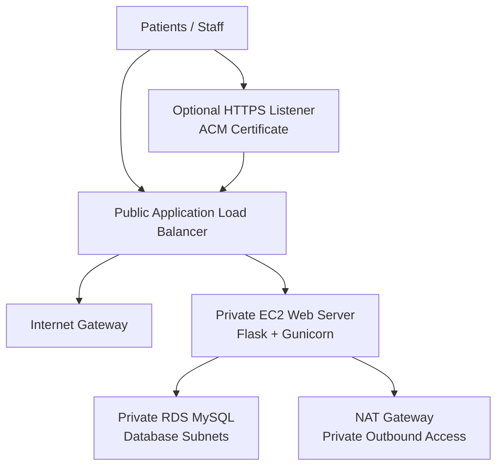

# MedCare Appointment Booking Platform on AWS

[](https://github.com/ucfavour23/medcare-appointment-booking-platform-on-aws/actions/workflows/ci.yml)


Production-style healthcare appointment booking platform deployed on AWS with a public Application Load Balancer, private EC2 application tier, private RDS MySQL database tier, Terraform automation, CI checks, optional HTTPS, and deployment evidence.


## At A Glance

| Category | Details |
| --- | --- |
| Project type | Cloud infrastructure and web application portfolio project |
| Business case | Secure internal appointment scheduling for a healthcare clinic network |
| Application | Flask appointment booking app with local SQLite and AWS RDS MySQL modes |
| Cloud architecture | VPC, public subnets, private app subnets, private DB subnets, ALB, EC2, RDS |
| Security model | ALB-only public entry, private EC2, private RDS, tiered security groups, optional HTTPS |
| Automation | Terraform provisioning, EC2 bootstrap script, Docker runtime, GitHub Actions CI |
| Evidence | Local app, test suite, Terraform workflow, ALB health, live AWS app, EC2 service status |

## Recruiter Review Path

If you only have a few minutes, review these sections first:

1. [Project evidence](#project-evidence) for screenshots proving the build.
2. [Architecture](#architecture) for the AWS design.
3. [Security and reliability](#security-and-reliability) for production-minded decisions.
4. [Validation](#validation) for tests and infrastructure checks.
5. [Recruiter brief](docs/recruiter-brief.md) for a concise interview-ready summary.

## Business Problem

MedCare needs a repeatable way to host an appointment booking workflow with public access through a controlled entry point while keeping application servers and patient scheduling data away from direct internet exposure.

The platform addresses:

- Public web access through an Application Load Balancer
- Private application server placement
- Private managed database storage
- Segmented network tiers
- Repeatable infrastructure deployment
- Evidence that the app, infrastructure, and deployment workflow work end to end

## Solution

This repository combines a working Flask booking application with Terraform-managed AWS infrastructure. The app runs locally with SQLite for quick development and testing, then runs on EC2 against RDS MySQL in the AWS deployment.

The result is a complete cloud portfolio project: application code, infrastructure-as-code, Docker packaging, CI validation, deployment documentation, and screenshots that prove the live system.

## Architecture



### AWS Design

| Layer | Implementation |
| --- | --- |
| Network | Custom VPC, public subnets, private app subnets, private database subnets |
| Public entry | Application Load Balancer with health checks |
| Compute | Ubuntu EC2 instance in a private subnet |
| Database | RDS MySQL in private database subnets |
| Egress | NAT Gateway for private app package installation and updates |
| Access control | Security groups scoped between ALB, EC2, and RDS tiers |
| Automation | Terraform resources and EC2 user data bootstrap |

## Security And Reliability

- The ALB is the only public entry point.
- EC2 has no public IP and only accepts app traffic from the ALB security group.
- RDS is private and only accepts MySQL traffic from the EC2 web tier.
- Optional HTTPS uses an ACM certificate on the ALB.
- HTTP redirects to HTTPS when `acm_certificate_arn` is configured.
- Flask adds common security headers including frame, content type, referrer, permissions, and HSTS headers.
- Terraform state, local databases, generated caches, and secrets are excluded from git.
- The `/health` endpoint supports ALB target group health checks.

## Features

- Appointment booking form
- Recent appointment history
- Local SQLite development mode
- RDS MySQL production-style mode
- Docker and Docker Compose support
- Terraform VPC, ALB, EC2, RDS, IAM, NAT Gateway, route tables, and security groups
- GitHub Actions workflow for tests, Terraform checks, and Docker build
- Screenshot evidence for app behavior, CI-style checks, infrastructure deployment, and live AWS status

## Technology Stack

| Area | Tools |
| --- | --- |
| Cloud | AWS VPC, ALB, EC2, RDS MySQL, IAM, NAT Gateway |
| Infrastructure | Terraform |
| Application | Python, Flask, Gunicorn, PyMySQL |
| Local database | SQLite |
| Containers | Docker, Docker Compose |
| Testing | Pytest |
| CI/CD | GitHub Actions |
| Documentation | Markdown, Mermaid diagrams, deployment screenshots |

## Project Evidence

The repository includes screenshots in `docs/screenshots/` to show the project working beyond code alone.

| Evidence | Screenshot |
| --- | --- |
| Local appointment dashboard |  |
| Appointment created and persisted |  |
| Python test suite |  |
| Terraform formatting |  |
| Terraform validation |  |
| Terraform plan |  |
| Terraform apply outputs |  |
| ALB target group health |  |
| Live AWS application through ALB |  |
| EC2 systemd service status |  |

See the [screenshot evidence guide](docs/screenshots.md) for the capture checklist and recommended replacement screenshots.

## Repository Structure

```text
app/                    Flask appointment booking application
docs/                   Architecture, deployment, screenshot, and recruiter docs
scripts/                Evidence and health-check helper scripts
terraform/              AWS infrastructure-as-code
tests/                  Flask application tests
.github/workflows/      CI workflow
Dockerfile              Container image definition
docker-compose.yml      Local container runtime
README.md               Project overview
```

## Run Locally

```powershell
python -m venv .venv
.\.venv\Scripts\Activate.ps1
pip install -r app\requirements.txt
python app\app.py
```

Open:

```text
http://127.0.0.1:5000
```

Run tests:

```powershell
python -m pytest -q
```

## Deploy On AWS

```powershell
cd terraform
copy terraform.tfvars.example terraform.tfvars
terraform init
terraform fmt
terraform validate
terraform plan
terraform apply
```

After deployment, open the `alb_dns_name` output in a browser.

## HTTPS Setup

AWS does not issue trusted certificates for the default ALB DNS name. To enable HTTPS, use a domain or subdomain you own:

1. Request an ACM certificate in the same AWS region as the ALB.
2. Validate the certificate with DNS.
3. Point the domain to the ALB using Route 53 alias or CNAME.
4. Set the certificate ARN in `terraform.tfvars`.
5. Run `terraform apply`.

```hcl
acm_certificate_arn = "arn:aws:acm:us-east-1:123456789012:certificate/your-certificate-id"
```

When enabled, Terraform creates the HTTPS listener, redirects HTTP to HTTPS, and enables HSTS in the deployed app.

## Validation

Run local checks:

```powershell
python -m pytest -q
terraform -chdir=terraform fmt -check
terraform -chdir=terraform init -backend=false
terraform -chdir=terraform validate
docker build -t medcare-appointments:local .
```

Current local verification:

| Check | Status |
| --- | --- |
| Python tests | Passing |
| Terraform format | Passing |
| Terraform validate | Passing from WSL validation workspace |
| Terraform plan | Succeeds from WSL validation workspace |
| Terraform apply | Completed during live deployment evidence capture |
| ALB target health | Healthy in captured evidence |

On this Windows machine, the AWS provider plugin can fail while loading Terraform schemas. The reliable validation path used during deployment was the persistent WSL workspace:

```powershell
wsl.exe bash -lc "cd ~/medcare-appointments-tf-validate && terraform validate"
```

## Documentation

- [Architecture notes](docs/architecture.md)
- [Deployment guide](docs/deployment-guide.md)
- [Screenshot evidence guide](docs/screenshots.md)
- [Project review](docs/project-review.md)
- [Recruiter brief](docs/recruiter-brief.md)
- [Project completion notes](docs/project-completion.md)

## Cost Control

This project uses small AWS resources, but NAT Gateway, ALB, EC2, and RDS can still create charges. Destroy the stack when the live demo is no longer needed:

```powershell
terraform destroy
```

## Skills Demonstrated

AWS networking, private subnet design, load balancing, RDS database deployment, Terraform infrastructure-as-code, Flask backend development, Docker packaging, GitHub Actions CI, security hardening, deployment evidence, and professional project documentation.
