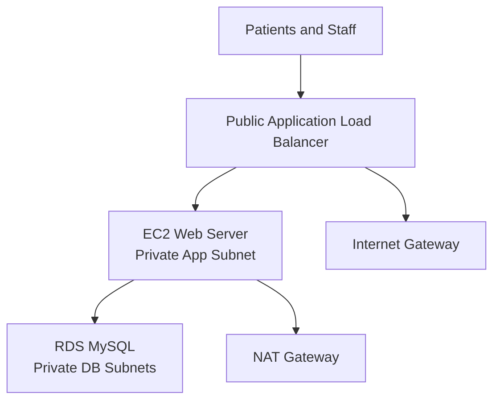

# MedCare Appointment Booking Platform on AWS

MedCare Appointment Booking Platform is a multi-tier web application project that demonstrates production-style AWS infrastructure for a healthcare scheduling workload.

The project deploys a Flask appointment booking app behind an Application Load Balancer, runs the web tier on EC2 in private subnets, and stores appointments in an RDS MySQL database isolated in private database subnets.


## Business Problem

MedCare needs a repeatable way to host an internal appointment booking system with:

- Public web access through a controlled load balancer
- Private application servers
- Private managed database storage
- Segmented network tiers
- Infrastructure-as-code deployment
- Clear operational evidence for recruiters and interview discussions

## Architecture



## AWS Services

| Layer | Services |
| --- | --- |
| Network | VPC, public subnets, private app subnets, private database subnets, route tables, Internet Gateway, NAT Gateway |
| Compute | EC2 Ubuntu web server |
| Database | RDS MySQL, DB subnet group |
| Traffic | Application Load Balancer, target group, listener |
| Security | Security groups, IAM instance profile |
| Operations | CloudWatch-ready EC2 role and deployment outputs |

## Repository Structure

```text
app/                    # Flask appointment booking application
docs/                   # Architecture, deployment guide, evidence checklist
scripts/                # Local evidence rendering helpers
terraform/              # AWS multi-tier infrastructure
tests/                  # Application tests
Dockerfile
docker-compose.yml
README.md
```

## Local Demo

```powershell
python -m venv .venv
.\.venv\Scripts\Activate.ps1
pip install -r app\requirements.txt
python app\app.py
```

Open:

```text
http://127.0.0.1:5000
```

Run tests:

```powershell
python -m pytest -q
```

## Terraform Workflow

```powershell
cd terraform
copy terraform.tfvars.example terraform.tfvars
terraform init
terraform fmt
terraform validate
terraform plan
terraform apply
```

After deployment, open the `alb_dns_name` output in a browser.

## Evidence Screenshots

Save important screenshots in `docs/screenshots/`:

| Evidence | File |
| --- | --- |
| Local app running | `app-local.png` |
| Appointment submission | `appointment-created.png` |
| Tests passing | `tests-passing.png` |
| Terraform formatting | `terraform-fmt.png` |
| Terraform validation | `terraform-validate.png` |
| Terraform plan | `terraform-plan.png` |
| Terraform apply outputs | `terraform-apply.png` |
| VPC subnet layout | `vpc-subnets.png` |
| ALB target health | `alb-target-health.png` |
| RDS database details | `rds-database.png` |
| Live AWS app | `ec2-dashboard-live.png` |
| EC2 service status | `ec2-systemd-status.png` |

## Recruiter Value

This project shows practical AWS engineering skills across networking, security groups, private compute, managed databases, load balancing, Terraform, Python application delivery, and documentation.

## Current Verification Notes

Local Python tests, Terraform formatting, and Terraform validation pass. On this machine, the Windows AWS provider plugin can fail while loading its schema, so the reliable validation path is the persistent WSL workspace:

```powershell
wsl.exe bash -lc "cd ~/medcare-appointments-tf-validate && terraform validate"
```

`terraform plan` succeeds from the WSL Terraform workspace and currently plans 29 resources.

Live deployment:

```text
ALB URL: http://medcare-appointments-alb-534651057.us-east-1.elb.amazonaws.com
VPC: vpc-00d32856044ebdc9c
EC2 web instance: i-0db702092e7f31e63
RDS endpoint: medcare-appointments-mysql.cc5guq6y2nty.us-east-1.rds.amazonaws.com
```
