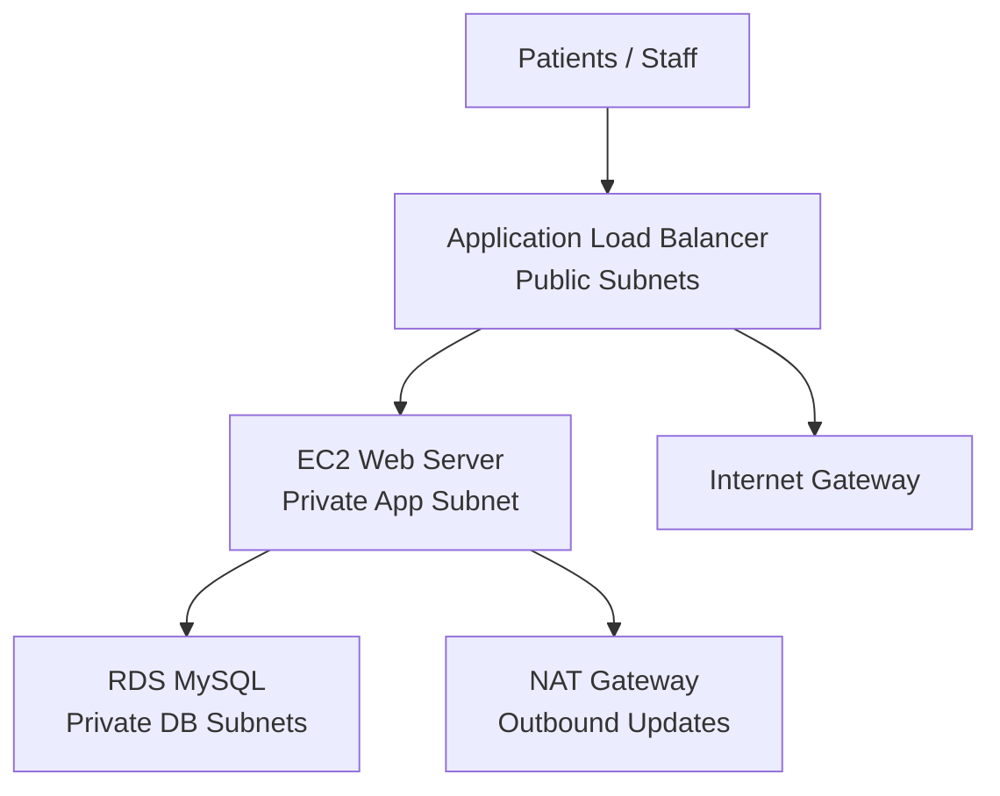

# Architecture

MedCare Appointment Booking Platform uses a three-tier AWS architecture designed to keep the public entry point separate from the application and database tiers.

## High-Level Design

## Network Tiers

| Tier | Purpose | Internet Exposure |
| --- | --- | --- |
| Public subnets | Host the ALB and NAT Gateway | Public entry through ALB only |
| Private app subnets | Host the EC2 web server | No direct public IP |
| Private database subnets | Host RDS MySQL | No public access |

## Traffic Flow

1. A user reaches the public ALB.
2. The ALB forwards healthy requests to the private EC2 web server on port `5000`.
3. The Flask app stores and reads appointment records from RDS MySQL.
4. EC2 uses the NAT Gateway only for outbound package installation and updates.
5. RDS accepts database traffic only from the EC2 web security group.

## Security Groups

| Security Group | Inbound Rule |
| --- | --- |
| ALB | HTTP `80` and optional HTTPS `443` from allowed CIDR ranges |
| EC2 web | App traffic `5000` from the ALB security group |
| RDS database | MySQL `3306` from the EC2 web security group |

## HTTPS Model

HTTPS is optional because a trusted certificate requires a domain name. When `acm_certificate_arn` is set:

- Terraform creates a port `443` HTTPS listener on the ALB.
- The HTTP listener redirects to HTTPS.
- The Flask service enables HSTS.
- The app remains private behind the ALB; TLS terminates at the load balancer.

## Operational Notes

- The `/health` endpoint supports ALB target group health checks.
- Terraform outputs expose the ALB URL, VPC ID, EC2 instance ID, RDS endpoint, and subnet IDs.
- The EC2 instance is bootstrapped with systemd so the Flask/Gunicorn service restarts automatically.
- Screenshot evidence is stored in `docs/screenshots/` to prove local validation and AWS deployment status.
