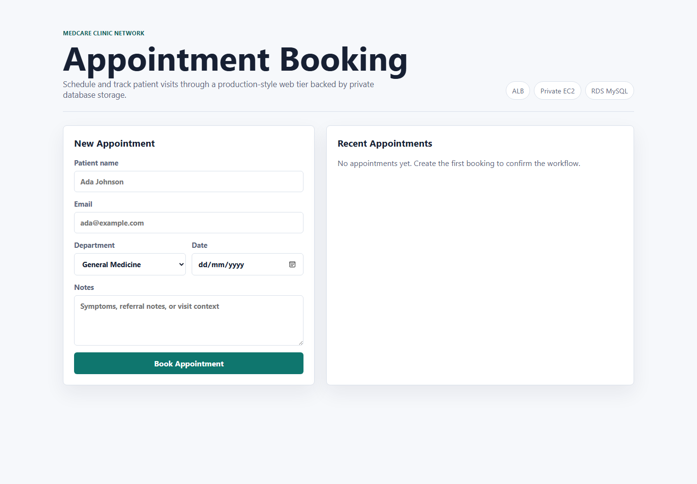
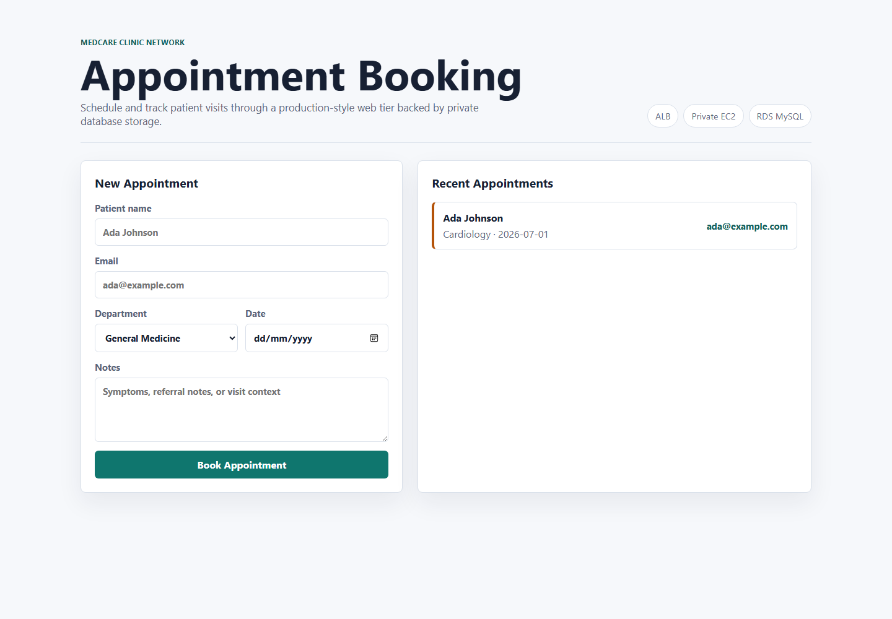
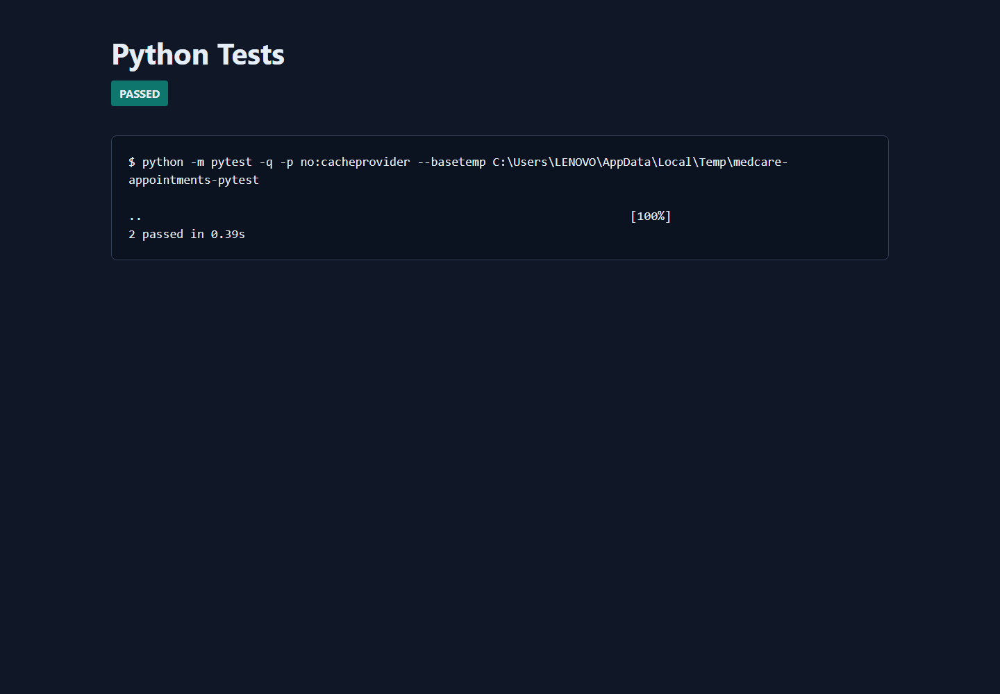
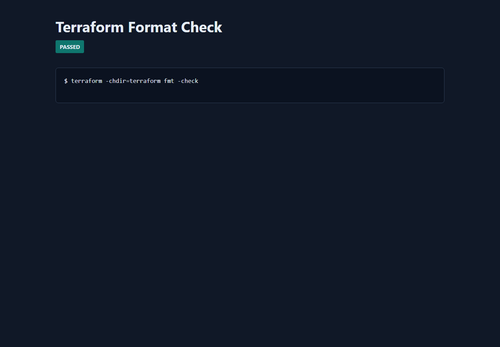
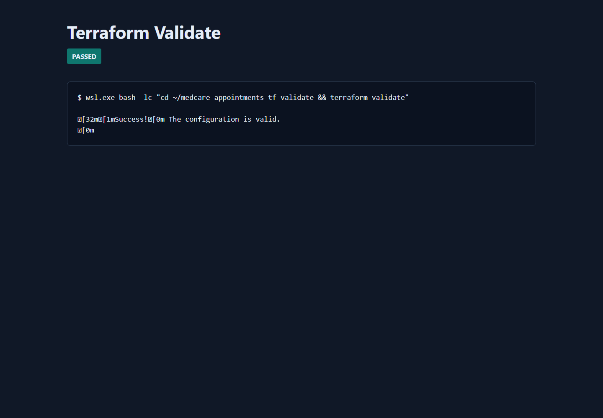
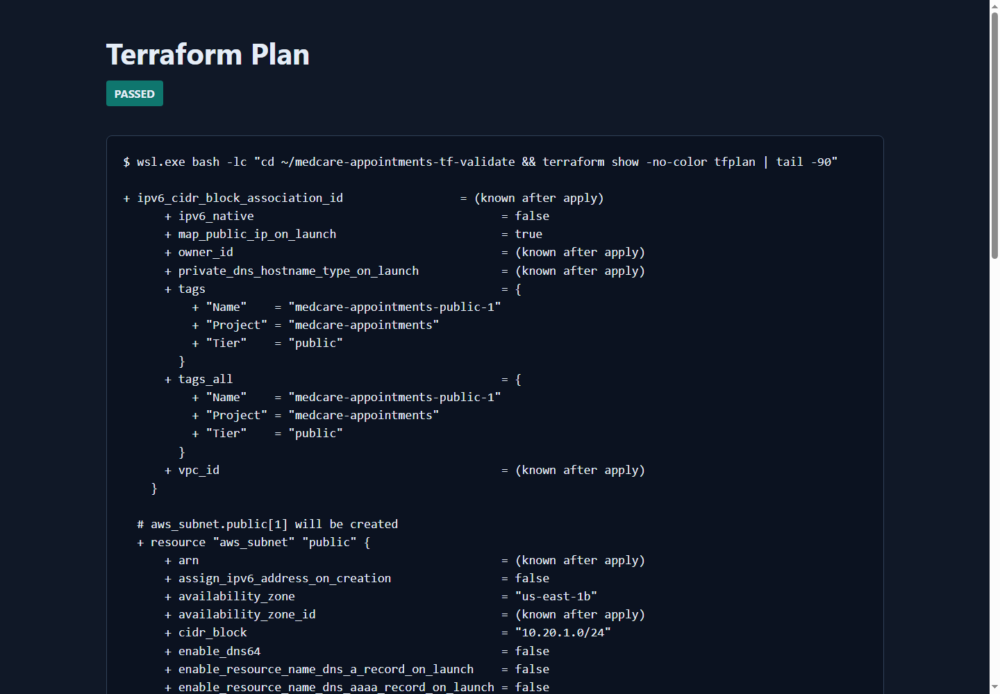
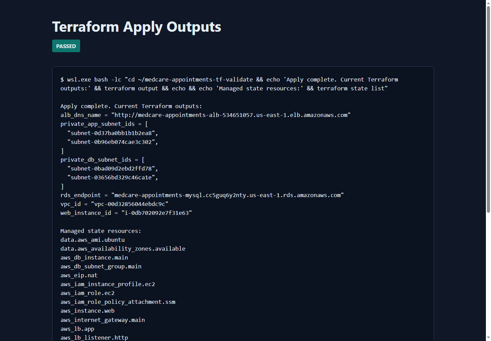
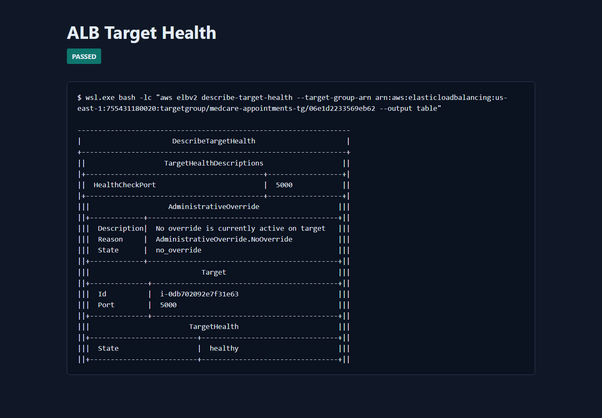
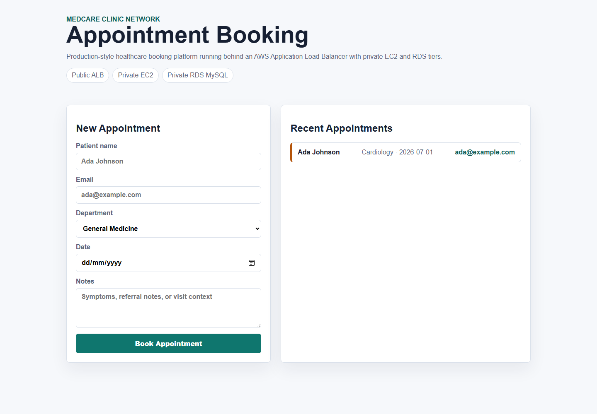
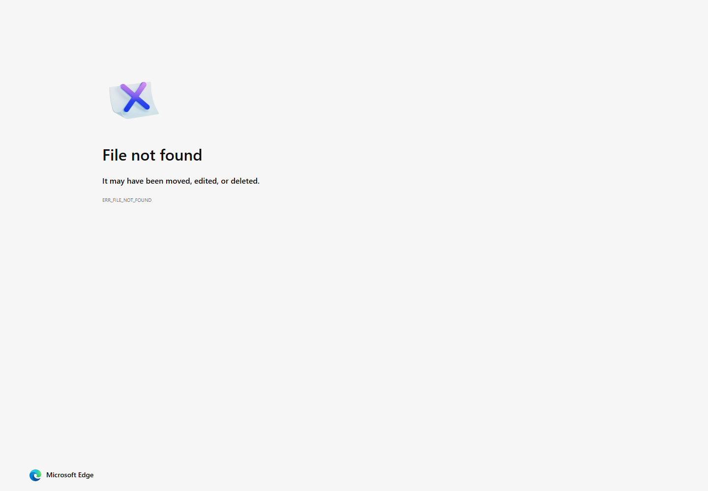

# Screenshot Evidence Guide

This project keeps GitHub documentation screenshots in `docs/screenshots/`. The goal is to prove the application, infrastructure, and deployment workflow at a glance.

## Included Evidence

| Evidence | Screenshot |
| --- | --- |
| Local appointment dashboard |  |
| Appointment created and displayed |  |
| Python test suite passing |  |
| Terraform format check |  |
| Terraform validation |  |
| Terraform plan |  |
| Terraform apply and outputs |  |
| ALB target group healthy |  |
| Live AWS app through ALB |  |
| EC2 service running under systemd |  |

## Evidence Still Worth Adding

| Screenshot | Why It Helps |
| --- | --- |
| `vpc-subnets.png` | Shows public, private app, and private database subnet segmentation in AWS. |
| `rds-database.png` | Shows the MySQL database deployed privately in the database subnet group. |
| `github-actions-ci.png` | Shows the GitHub Actions workflow passing after the repository push. |
| `https-browser.png` | Shows the custom domain loading over HTTPS after ACM is configured. |

## Capture Guidance

Prioritize screenshots that prove architecture and operations, not only the UI. A strong final evidence set should answer:

- Can the app run locally?
- Do tests pass?
- Does Terraform format, validate, plan, and apply?
- Is the ALB target healthy?
- Is the EC2 service running?
- Is the database private?
- Does the live app work through the public entry point?
- If HTTPS is enabled, does the browser show a trusted secure connection?

## Recommended Commands

Refresh local validation evidence with:

```powershell
python -m pytest -q
terraform -chdir=terraform fmt -check
terraform -chdir=terraform validate
terraform -chdir=terraform plan
terraform -chdir=terraform output
```

Refresh live AWS evidence with:

```powershell
aws elbv2 describe-target-health --target-group-arn <TARGET_GROUP_ARN>
aws ec2 describe-instances --instance-ids <INSTANCE_ID>
aws rds describe-db-instances --db-instance-identifier medcare-appointments-mysql
```

After HTTPS is enabled, capture the browser address bar showing the custom domain with a valid certificate.
